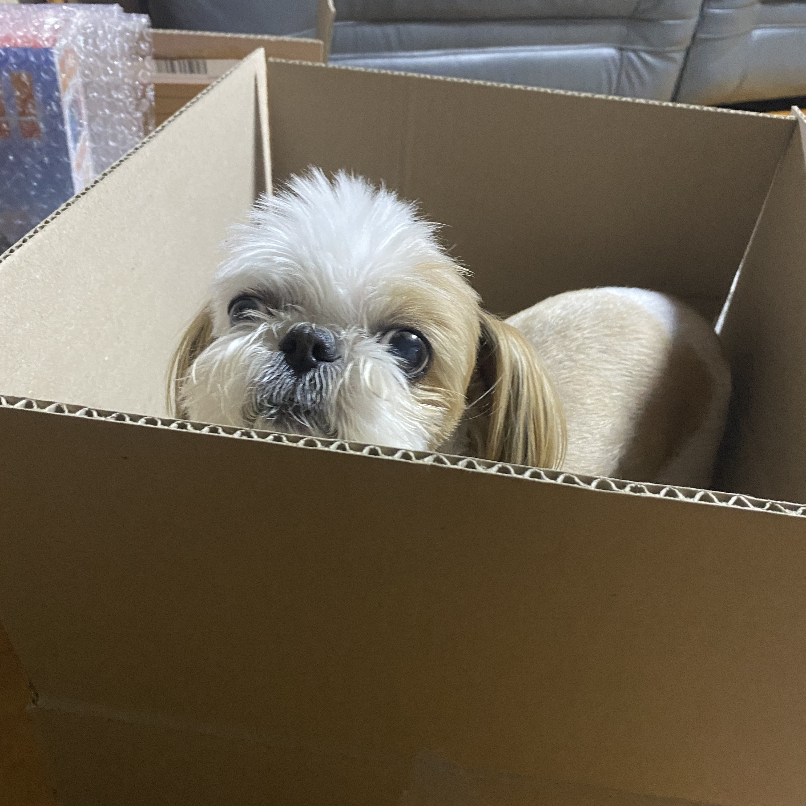

기술 관련 블로그를 처음 시작 하는건 아니다. 대학때 알고리즘 관련 블로그 포스팅을 하기도 했고, Github Pages로 정적페이지를 만들어 블로그를 해보았다.
하지만 내 이름으로 된 블로그를 갖고 싶었고, 마침 JAMStack관련 영상을 보아서 Gatsby + Netlify로 블로그를 개설하였다.
시기가 회사를 옮기는 시기라 시간적 여유가 있어서 포스팅 목표에 대해 적어보려 한다.

# 포스팅 목표

```
hihi
```

>ddd
ddd

